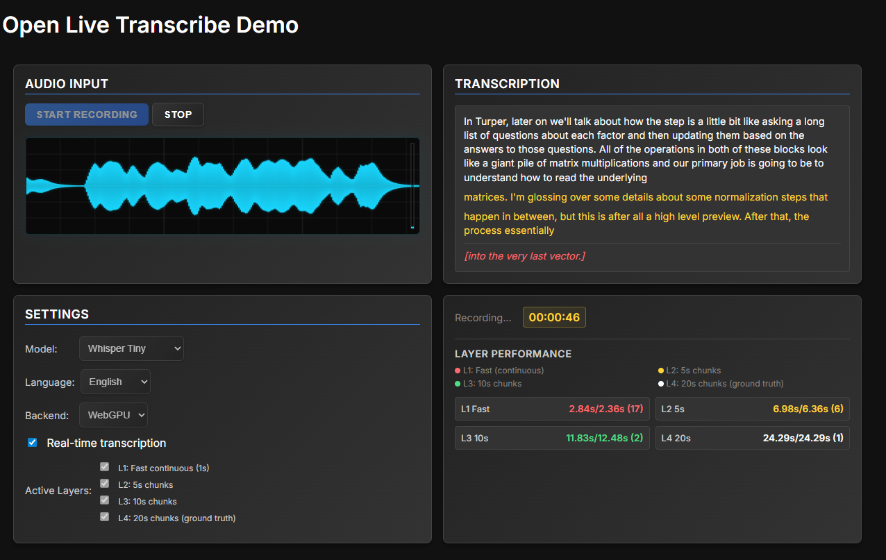

# LiveTranscribe

**Real-time speech-to-text transcription running entirely in your browser**

LiveTranscribe is a privacy-focused, local-only speech-to-text transcription tool that operates entirely within the web browser. Unlike cloud-based services, all processing occurs on the user's device with no audio data transmitted to external servers.

## Key Features

- **Complete Local Processing** - Entire transcription pipeline executes within the browser utilizing WebAssembly and ONNX Runtime
- **Multi-Layer Transcription Architecture** - Implements an advanced multi-agent approach employing four distinct transcription layers to optimize accuracy and processing speed
- **Real-Time Transcription Capability** - Provides live transcription during speech with concurrent multi-layer processing
- **Comprehensive Audio Capture** - Supports audio capture from browser tabs, applications, and complete screen environments
- **Multiple Model Support** - Offers selection among Tiny, Base, Small, Medium, and Large v3 Whisper model variants
- **Advanced Execution Backends** - Provides hardware acceleration via WebGPU with WebAssembly fallback capabilities
- **Multi-Language Compatibility** - Supports transcription in English, Spanish, French, Japanese, and additional languages
- **Audio Visualization** - Implements real-time waveform visualization of audio input
- **Performance Analytics** - Provides detailed timing statistics for each transcription layer

## System Architecture

LiveTranscribe employs a sophisticated multi-agent transcription methodology:

### Transcription Layer Hierarchy

- **L1: Continuous Processing** (1s intervals) - High-velocity word-level transcription providing immediate user feedback
- **L2: Short-Term Segmentation** (5s chunks) - Balanced performance characteristics for brief audio segments
- **L3: Medium-Term Segmentation** (10s chunks) - Enhanced accuracy for intermediate-length content
- **L4: Long-Term Segmentation** (20s chunks) - Ground truth accuracy for final transcription quality

### Technical Implementation

- **Frontend Framework**: Vanilla JavaScript utilizing contemporary Web APIs
- **Machine Learning Runtime**: ONNX Runtime Web supporting both WebAssembly and WebGPU execution
- **Model Architecture**: Whisper transformer family accessed via Hugging Face Transformers library
- **Audio Processing Pipeline**: Web Audio API implementation with integrated real-time visualization
- **Build System**: Vite development environment for optimized production compilation

## Current Development Status

### Implemented Capabilities

- **Real-time transcription functionality** with multi-layer processing architecture (L1-L4)
- **Screen and tab audio capture** functionality in Chrome and Edge browsers
- **Multiple Whisper model variants** (Tiny, Base, Small, Medium, Large v3)
- **WebGPU hardware acceleration** for compatible hardware configurations
- **Real-time audio visualization** and comprehensive performance monitoring
- **Multi-language transcription support** (English, Spanish, French, Japanese)

### Under Development

- **Web-based demonstration environment** - Currently restricted to local development
- **Browser extension implementation** - Planned for simplified system-wide audio capture
- **Real-time translation functionality** - Multi-language translation capabilities

### Known Constraints

- **Firefox browser compatibility** - Limited functionality due to browser audio capture API restrictions
- **Safari browser support** - Not supported due to absence of WebGPU and advanced audio APIs
- **Mobile browser compatibility** - Limited support attributable to WebGPU availability constraints
- **Large model requirements** - Substantial RAM requirements (4GB+ recommended)

## Installation and Configuration

### Development Environment Setup (Recommended)

```bash
# Clone the repository
git clone https://github.com/FuouM/LiveTranscribe.git
cd LiveTranscribe/live-transcribe-web

# Install project dependencies
npm install

# For WASM support
node scripts/copy-wasm.js

# Initiate development server
npm run dev

# Access application at http://localhost:5173 in Chrome browser
```

## Configuration Parameters

### Whisper Model Variant Selection

- **Tiny (Q8_0)**
- **Base (Q6_K)**
- **Small (Q5_1)**
- **Medium (Q4_1)**
- **Large v3 (Q4_0)**

### Execution Backend Configuration

- **WebGPU** - Hardware acceleration implementation (recommended for contemporary GPU architectures)
- **WebAssembly** - CPU-based fallback with multi-threading capabilities

## Privacy and Security Considerations

- **Complete Local Processing** - All computational operations execute locally without external connectivity
- **Zero Data Exfiltration** - Audio data remains confined to the user's device at all times
- **Client-Side Architecture** - Absence of server-side components or cloud service dependencies
- **Open Source Transparency** - Fully auditable source code available for security analysis

## Development Roadmap

### Planned Feature Enhancements

- [ ] **Browser Extension Implementation** - Facilitated installation with comprehensive system-wide audio capture
- [ ] **Real-Time Translation Capability** - Multi-language translation functionality
- [ ] **Multi-Speaker Meeting Support** - Enhanced transcription for collaborative environments
- [ ] **Export Functionality** - Transcript preservation in TXT, SRT, VTT formats
- [ ] **Keyboard Interface** - Accelerated recording initiation and termination
- [ ] **Mobile Platform Support** - Progressive Web Application for mobile devices
- [ ] **Custom Vocabulary Integration** - Domain-specific terminology recognition

### Technical Enhancement Objectives

- [ ] **Firefox Compatibility** - Resolution of audio capture API limitations
- [ ] **Safari Compatibility** - WebGPU polyfill implementation
- [ ] **Model Optimization** - Advanced quantization and performance refinement
- [ ] **Offline PWA Implementation** - Complete offline operational capability

## Contributor Participation

Contributions are welcome. This project seeks to democratize access to privacy-preserving artificial intelligence technologies.

### Development Environment Configuration

```bash
# Install project dependencies
npm install

# Initiate development server with hot-reload functionality
npm run dev

# Execute production build for validation
npm run build
```

### Contribution Focus Areas

- Browser compatibility enhancement initiatives
- Performance optimization research and implementation
- User interface and experience refinements
- Extended language support development
- Model quantization and compression research

## Licensing Information

This project is distributed under the MIT License - refer to the [LICENSE](LICENSE) file for comprehensive licensing details.

## Acknowledgments

- **OpenAI** for the foundational Whisper model architecture
- **Hugging Face** for model repository hosting and the Transformers.js implementation
- **Microsoft Corporation** for the ONNX Runtime Web framework
- **Xenova** for optimized Whisper model implementations

## Technical Support

- **Issue Reporting**: [GitHub Issues](https://github.com/yourusername/live-transcribe/issues)
- **Community Discussions**: [GitHub Discussions](https://github.com/yourusername/live-transcribe/discussions)

---


